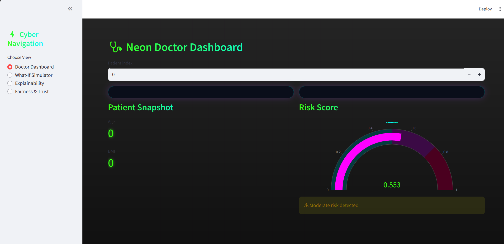
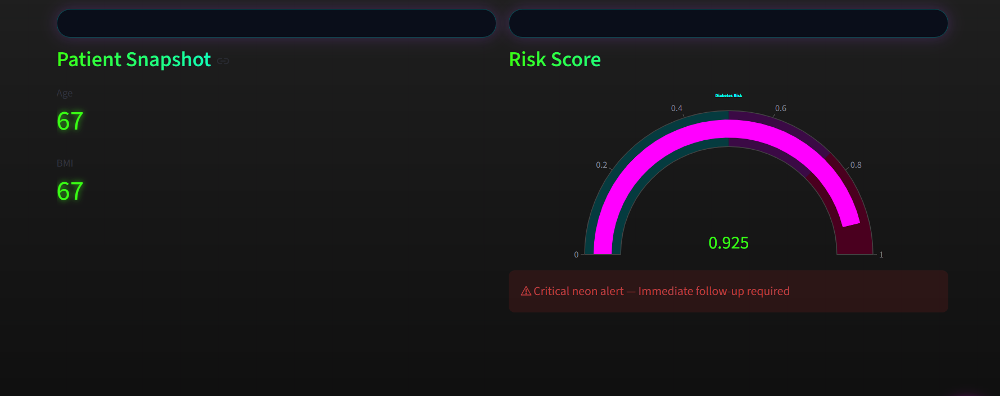
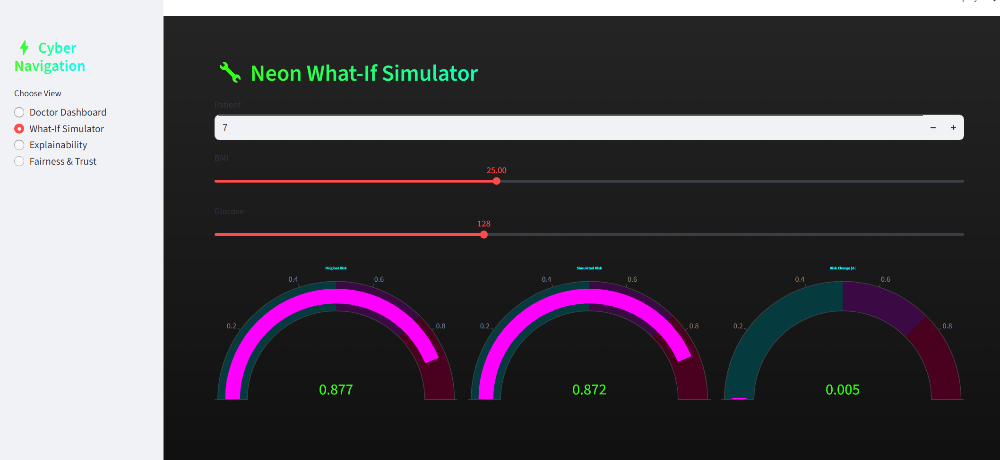
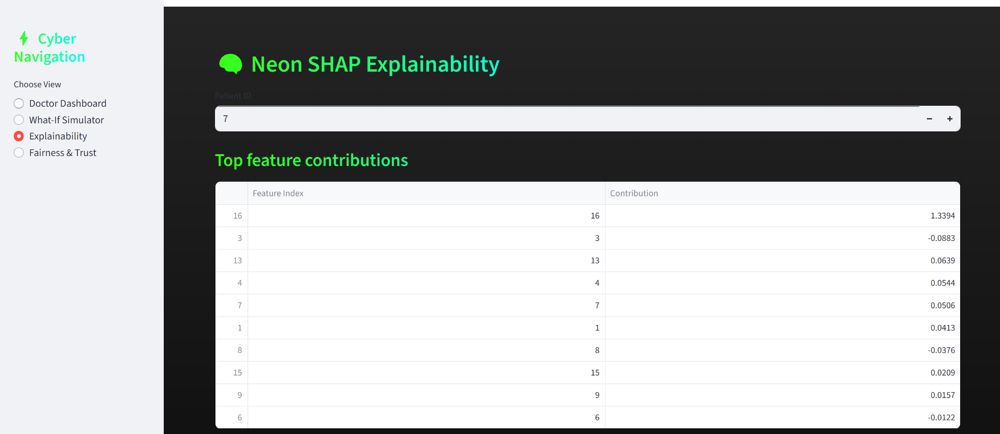
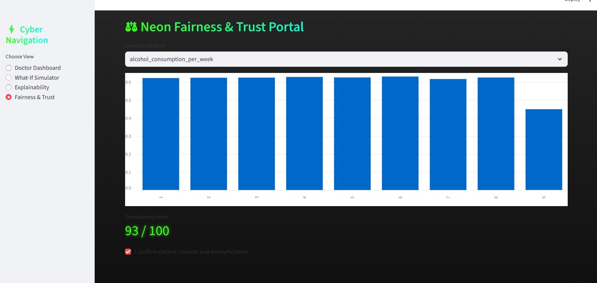

# ⚡ Neon Cyber — Explainable Diabetes AI Dashboard

An interactive neon-themed **Explainable AI dashboard** for diabetes risk prediction with:

- Doctor Dashboard
- What-If Risk Simulator
- SHAP Explainability
- Fairness & Trust Analysis
- Cyber-Neon UI Theme

This project demonstrates **Responsible AI in Healthcare** with transparency, fairness, explainability, and patient-centric interpretation.

---

## 🛡 Badges


---

## 🩺 Project Screenshots

### Doctor Dashboard


### High-Risk Alert


### What-If Simulator


### Explainability View


### Fairness & Trust Portal


---

## 🧠 Key Features

✔ Real-time diabetes risk scoring  
✔ Apple-style neon UI dashboard  
✔ Patient-friendly interpretation text  
✔ SHAP explainability (local + global)  
✔ What-If lifestyle change simulator  
✔ Bias & subgroup risk analysis  
✔ Designed for recruiters and healthcare AI portfolios  

---

## 🧩 Tech Stack

- Python
- Streamlit
- Scikit-Learn
- SHAP
- Plotly
- Pandas / NumPy

---

## 🚀 Run Locally

### 1️⃣ Clone repository

```bash
git clone https://github.com/YOUR_USERNAME/YOUR_REPOSITORY_NAME.git
cd YOUR_REPOSITORY_NAME
```

### 2️⃣ Create virtual environment

```bash
python -m venv venv
venv\Scripts\activate
```

### 3️⃣ Install dependencies

```bash
pip install -r requirements.txt
```

### 4️⃣ Launch the app

```bash
streamlit run app.py
```

---

## 🧠 Explainable AI

Includes:

- SHAP waterfall explanation
- Top feature contribution table
- Instance-level reasoning
- Clear medical language mapping

Example output:

> “High glucose and BMI are the key drivers of this patient's risk.”

---

## ⚖ Responsible AI & Governance

The app includes:

- fairness group comparison
- transparency score
- explicit consent checkbox
- audit-friendly outputs

This supports:

- Responsible AI
- Healthcare ML governance
- Model risk management concepts

---

## 🏥 Medical Disclaimer

This tool is **NOT a medical device**.  
It is for **learning and research only**.

Do not use for diagnosis or treatment.

---

## 👤 Author

**Tonumay Bhattacharya**

Data Science | Machine Learning | Generative AI | Healthcare AI

---

⭐ If you like this project, please **star the repository**.
